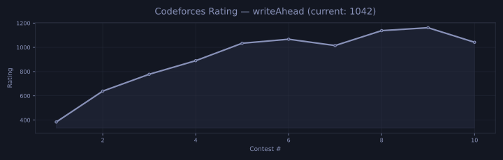

 

 

 

## 🚀 About Me

Software Engineering enthusiast with a strong foundation in **Data Structures & Algorithms**, **Competitive Programming**, **Backend Development**, and **System Design**.

I enjoy solving challenging algorithmic problems, understanding systems from first principles, and building efficient software with a focus on performance, scalability, and maintainability.

 

## 🛠️ Tech Stack

<table align="center">
<tr>
<td align="center"><b>Languages</b> </td>
</tr>
<tr>
<td align="center"><b>Backend & Databases</b> </td>
</tr>
<tr>
<td align="center"><b>Tools</b> </td>
</tr>
</table>

**Core CS:** Data Structures & Algorithms • OOP • Operating Systems • DBMS • Computer Networks • System Design

 

## 🏆 Competitive Programming

 

## 📈 Contribution Activity

 

## 🐍 Contribution Snake

<picture>
  <source media="(prefers-color-scheme: dark)" srcset="https://github.com/WriteAHead/WriteAHead/blob/output/github-contribution-grid-snake-dark.svg" />
  <source media="(prefers-color-scheme: light)" srcset="https://github.com/WriteAHead/WriteAHead/blob/output/github-contribution-grid-snake.svg" />
  
</picture>

 

## 🎯 Current Focus

- Advanced Data Structures & Algorithms
- Dynamic Programming • Graph Algorithms
- Low-Level Design (LLD) • High-Level Design (HLD)
- Backend Development • Distributed Systems
- Scalable Software Systems

 

## 📫 Connect

<a href="https://github.com/WriteAHead">GitHub</a> •
<a href="https://leetcode.com/u/writeAhead/">LeetCode</a> •
<a href="https://codeforces.com/profile/writeAhead">Codeforces</a> •
<a href="https://atcoder.jp/users/writeAhead">AtCoder</a> •
<a href="https://www.geeksforgeeks.org/profile/writeahead">GeeksforGeeks</a>

<b style="color:#8891b8">Understand. Build. Optimize.</b>

